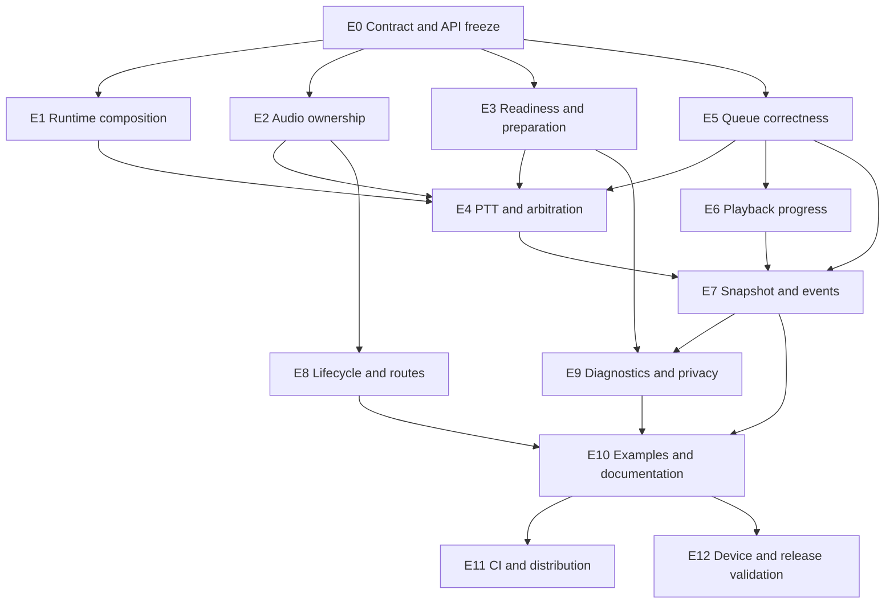

# AppLocalVoice integration-readiness implementation plan
Status: implementation-ready planning baseline  
Audit date: 2026-07-12  
Scope: standalone open-source `AppLocalVoice` library only
## 1. Objective
AppLocalVoice should let an iPhone or iPad application that already has a text chat interface add two capabilities with minimal application code:

1. start a local Apple speech-recognition turn, show live text, and await one authoritative final transcript when the user ends the turn;
  
2. speak arbitrary text immediately or through a bounded, observable queue.
  

The package owns Apple speech and audio mechanics. The host owns its chat UI, composer, messages, backend, streaming protocol, persistence, and decision to submit or speak text.

This document is the execution source for the remaining work. It supersedes the earlier version of this plan where they conflict. It records confirmed gaps in the current source, freezes the intended product behavior, breaks the work into small tickets, and defines how parallel agents must implement and review it.
## 2. Non-goals and hard boundaries
The following must not enter the package:

- any specific host-app cutover;
  
- hub, SSE, queued-TTL, supersession, endpoint, authentication, account, or backend protocol logic;
  
- chat message storage, server submission, response persistence, or retry UI;
  
- a keyboard extension, replacement keyboard, or replacement chat interface;
  
- cloud speech recognition or an automatic cloud fallback;
  
- background microphone capture, full-duplex conversation, or automatic silence-based turn submission;
  
- public third-party provider protocols in the first release.
  

Host applications may build these behaviors around the library, but they are not library responsibilities.
## 3. Baseline and audit evidence
The current worktree already has substantial deterministic hardening:

- 201 XCTest methods with one documented SDK skip in the latest complete simulator run;
  
- a strict iOS-targeted Swift build with warnings treated as errors;
  
- 519 allowlisted public symbols with source documentation and API markers;
  
- bounded transcript/event/queue structures, typed failures, owner-scoped audio leases, Apple adapter seams, and release-evidence tooling;
  
- a portable Local Echo sample and DocC catalog.
  

Those facts do not make the library integration-ready. The fresh code audit confirmed these release-significant gaps:

1. `AudioSessionBroker.exit` restores category state but does not normally deactivate with `notifyOthersOnDeactivation`, so interrupted podcasts may not be told to resume.
  
2. The broker can restore a stale pre-voice snapshot over audio configuration that the host changed while voice owned its lease; reconciliation can later deactivate a newly host-owned session.
  
3. `VoiceCoordinator.deinit` releases the process lease only when no operation exists. Dropping an active facade can strand future clients behind `serviceInUse` indefinitely.
  
4. Every public `AppLocalVoice()` creates a distinct facade even though only one process owner may mutate voice state. There is no canonical app-composition or multi-client injection path.
  
5. `finishSession(id:)` cancels and throws when PTT release arrives during provider preparation. A quick press/release therefore cannot await a final result.
  
6. Public readiness types such as `VoiceCapabilitySnapshot` exist, but the facade only returns the older `SpeechCapabilities` model.
  
7. The default SpeechAnalyzer path still calls the legacy `SFSpeechRecognizer.requestAuthorization` flow. Apple distinguishes the local SpeechAnalyzer privacy model from server recognition, so the exact authorization requirement must be proven and the library must not request an irrelevant permission.
  
8. A new canonical event subscriber receives only recovery state. It cannot reconstruct active recognition, the latest preview, current playback, or queue state after navigation or an overflow.
  
9. `VoiceRecoveryAction.reconcileEventState` is public, but there is no public state-reconciliation API.
  
10. Queue pause/resume currently publishes state before knowing whether `AVSpeechSynthesizer` accepted the control. The provider return value is discarded, making `providerRejected` effectively unreachable.
  
11. Stop, skip, replace, and clear can terminalize queue attempts before output cleanup has been proven. A rejected stop can leave audio playing after a misleading terminal result.
  
12. Direct speech can win a scheduler race after the queue marks an attempt current but before it reserves the coordinator; the queued attempt is then failed and the queue suspended even though direct speech should leave it intact.
  
13. The internal playback waiter is not public, and cancelling it stops the whole queue instead of only cancelling the caller's wait.
  
14. Apple character-range callbacks are used only to reset the TTS watchdog; the ranges are discarded. Direct speech also has no public playback identity with which progress could be correlated.
  
15. Queue limits bound item counts but not aggregate retained text. The permitted default history and pending counts can retain an excessive amount of text when individual items approach the per-item ceiling.
  
16. Range-local empty transcript replacements, evolving grapheme clusters, and currently unpopulated transcript timing metadata have unresolved contracts. In particular, an opaque phrase-level `CMTimeRange` cannot safely preserve the left/right text of a partial overlap; exact deletion requires Apple text-to-audio-range attributes to flow through the provider seam.
  
17. Public diagnostics types and a privacy-safe implementation exist only as internal test seams, leaving real adopters without a supported production troubleshooting path.
  
18. Documentation describes some unimplemented behavior as accepted, including input-wins recognition and truthful provider-rejected queue controls.
  
19. Local Echo still demonstrates compatibility APIs and closes its service on view disappearance. It does not exercise the app-scoped service, session API, queue, resubscription, or playback progress.
  
20. CI does not build/validate Local Echo, and the tag workflow requires a previous semantic tag, making the first release impossible to validate.
  
21. The checkout has no Git repository or canonical URL, CODEOWNERS contains a placeholder, and the private security-reporting route is not actionable.
  
22. AirPods, routes, interruptions, competing audio, local model installation, energy, thermal behavior, endurance, and process relaunch remain unproven on physical hardware.
  

Primary source locations for these findings are:

- `AppLocalVoice.swift`
  
- `VoiceCoordinator.swift`
  
- `AudioSessionController.swift`
  
- `ProcessVoiceRuntimeLease.swift`
  
- `AppleSpeechInput.swift`
  
- `AppleSpeechOutput.swift`
  
- `SpeechQueueEngine.swift`
  
- `CanonicalVoiceEventDelivery.swift`
  
- `TranscriptAssembler.swift`
  
- `StableTranscriptPublisher.swift`
  
- `LocalEchoModel.swift`
  
- `release-validation.yml`
  
## 4. Frozen product decisions
Implementation agents must follow these decisions. A ticket may refine naming or internal mechanics, but changing a decision requires an explicit plan edit and integrator approval.
### D1 — Backend-neutral text boundary
The library receives or produces text. It never receives a backend client, message object, conversation ID, endpoint, SSE event, or submission callback.
### D2 — One explicit app-owned service
The recommended architecture is one `AppLocalVoice` instance created by the application composition root and injected into every feature that needs it. The first release will not introduce a hidden global singleton. Documentation must show SwiftUI environment/dependency injection and ordinary initializer injection for UIKit or view models.

Multiple consumers may observe and call the same service. Independently constructed mutating facades remain rejected before provider mutation. A consumer going away must not call `close()` on a shared service it does not own.

Host unit tests use a consumer-owned narrow protocol declared in the host target, with `AppLocalVoice` conformed by an extension. The library does not publish a large all-purpose service protocol in v1.0.
### D3 — Session API is the canonical recognition API
`startSession`, `finishSession`, `cancelSession`, typed session IDs, typed transcript publications, and the canonical event stream are the first-release chat integration path. Legacy `startListening`, `finishListening`, `cancelListening`, `events`, and `recognitionEvents` are compatibility candidates, not co-equal documentation paths. Because no release has been published, the pre-1.0 API audit may remove redundant or unreachable surface instead of preserving it indefinitely.
### D4 — PTT release latches finish intent
Releasing PTT after a session is accepted must await that exact session's terminal finalization, even if permission, model preparation, or provider startup is still in progress. It must not silently become cancellation merely because the press was short. Explicit Cancel remains a separate action.

If startup ultimately fails or is interrupted, finish returns the typed terminal failure. If no speech is recognized, a successful empty final transcript is allowed; the host must not auto-submit empty text.
### D5 — Recognition remains local and prepared explicitly
The shipped provider uses `SpeechAnalyzer`/`SpeechTranscriber` with no cloud fallback. The package will expose a side-effect-clear snapshot query and an explicit preparation path for permissions/model readiness. Model installation is opt-in, cancellable, and may require Apple-managed network access. Starting microphone capture is always a separate action.
### D6 — Recognition wins over active speech in the chat profile
The first-release behavior is always input-wins: starting recognition stops active speech, terminalizes it as superseded by recognition only after output stop is confirmed, suspends pending queue work, then admits microphone capture. Pending speech never resumes automatically. The first release has no second reject-overlap profile; independently constructed facades are still rejected by process ownership, which is a different concern.
### D7 — Audio-session ownership is explicit
The default, library-managed mode may configure and activate AVAudioSession. On final release it must stop its Apple audio objects, deactivate with `notifyOthersOnDeactivation`, and restore only configuration it still owns. Apple documents that this deactivation option is how interrupted audio sessions are told they may resume.

A host-managed/coordinated mode must exist for apps that already own an audio engine, call stack, camera session, or custom AVAudioSession lifecycle. In that mode AppLocalVoice must not blindly restore or deactivate host state. The exact public spelling and coordination seam are frozen by `AUD-01` before source implementation begins.

No mode may overwrite a host mutation from a stale snapshot or deactivate a session whose ownership cannot be proven.
### D8 — First-release background policy is stop, suspend, explicit resume
The library does not promise background TTS. Entering the background ends active recognition or playback with a typed reason, retains and suspends pending queue work, releases audio resources, and never auto-restarts on foreground. Public singleton policy types that imply choices the implementation does not provide should be simplified or removed during the API audit.
### D9 — Queue controls are transactional and truthful
Pause/resume publish a state change only after the provider accepts it. Stop, skip, replacement, and input-wins arbitration publish one terminal outcome only after output cleanup is confirmed.

If stop is rejected or misses the cleanup deadline, the queue suspends, the active attempt reaches one failed cleanup terminal, pending attempts remain retained, recovery becomes blocked, and no replacement or recognition session receives an acceptance identity. `replaceCurrent` and `replaceAll` therefore validate first but commit acceptance only after the active stop succeeds. `stopAndClear` may cancel pending attempts immediately, but the active attempt still reports cleanup failure rather than a false stopped result.
### D10 — Events are finite; snapshots are the reconciliation mechanism
The package will not retain an unbounded replay log. A canonical subscription receives one coherent current runtime snapshot before subsequent ordered events. After overflow, cancellation, navigation, or app UI reconstruction, the host queries a new snapshot and opens a new stream. Cursors identify gaps for diagnostics; they are not promises of server-style replay.
### D11 — All playback has correlation identity
Queued and immediate speech share one playback identity model. The existing awaiting `speak` remains an ergonomic convenience, but an additive identified immediate-play API must let a host receive acceptance, await terminal result, and correlate advisory progress. Item/replay semantics remain queue-specific.

Character progress is the original-text UTF-16 range reported as “will speak” by Apple. It is advisory, may coalesce, is not phoneme timing, and does not replace the durable terminal outcome.
### D12 — IDs and replay state are process-local
Session, item, and playback IDs are valid only for the owning service's retained in-memory state. Queue history may be evicted and is cleared by full close. Hosts may correlate IDs with visible messages during that lifetime, but must not treat them as durable persistence identifiers across process relaunch.
### D13 — Production diagnostics are opt-in and content-free
Expose a bounded, privacy-safe diagnostic surface containing only operation identity, phase, stable category, coarse route class, state, and monotonic duration. It contains no audio, transcript text, TTS text, voice name, device name, provider description, credential, or arbitrary host input. The host owns storage and export.
### D14 — Safety is bounded by aggregate resources, not counts alone
Keep per-item/per-transcript limits, add aggregate pending/history text budgets, bound advisory progress/preview retention, and define an optional maximum recognition duration. Cancellation and cleanup remain bounded even when Apple tasks are non-cooperative.
## 5. Target adopter journeys
The implementation is not complete until all of these journeys are supported and tested or, where noted, physically validated:

| Journey | Required outcome |
| --- | --- |
| Fresh package install | A clean external app resolves a semantic version from the canonical Git URL and imports one product. |
| Three app features | Three view models receive the same app-owned service; no competing process owners are created. |
| First-run readiness | The app queries permission/model/locale state, optionally prepares a model, and starts capture only after explicit user action. |
| Fast PTT tap | Press accepts a session; immediate release latches finish and returns final or a typed startup failure—never an incidental invalid-state/cancel result. |
| Ordinary PTT | Previews replace only the voice-owned composer range; final text is returned once; the library never submits it. |
| PTT during TTS | Active playback stops as superseded, pending queue work suspends, and recognition begins only after output resources are released. |
| Podcast restoration | Library-managed speech interrupts external audio when configured, then deactivates/notifies so the external audio may resume. |
| Host-owned audio stack | Coordinated mode does not overwrite or deactivate the host's newer AVAudioSession state. |
| Navigation/resubscription | A new consumer receives a coherent runtime snapshot and can render active recognition/playback/queue state before new events. |
| Queue result | A caller may enqueue, await only that playback ID, cancel only its wait, and still observe one durable terminal outcome. |
| Unicode progress | Emoji, combining marks, CJK, punctuation, whitespace, and multi-chunk text map to original UTF-16 ranges without stale callbacks. |
| Background/route/interruption | Active work ends once with a typed cause; pending queue work stays suspended; nothing auto-resumes. |
| Cleanup failure | New work is blocked, snapshot/recovery agree, and explicit close/reconcile either succeeds or remains typed blocked. |
| Relaunch | Old in-memory item/playback IDs are treated as unavailable; the host can enqueue text again. |
| Accessible sample | Recording state is visible and announced, controls remain usable without press-and-hold, and host strings/errors are localizable. |
## 6. Dependency graph and execution waves
Git publication is an end gate, not a dependency for local source work.



Recommended waves:

- Wave 0: E0 contract/API and resource-budget work. No behavior implementation
  starts until the target surface, ownership policies, and aggregate limits are
  approved.

  `LIM-01` is an E0 prerequisite ticket, not part of the later E9 diagnostics
  wave. RT-02, QUE-05, and PTT-03 cannot start until its numeric table is
  approved.
  
- Wave 1, parallel: RT-01 composition, E2 audio, E3 readiness, and E5 queue
  provider/pure-engine work. RT-02 and coordinator integration wait for audio
  cleanup semantics.
  
- Wave 2, controlled integration: E4 PTT/arbitration, E6 progress, E8 lifecycle,
  and E9 diagnostics/privacy. `VoiceCoordinator.swift` changes are serialized.
  
- Wave 3: E7 snapshots/event delivery after scheduler identities stabilize.
  
- Wave 4, parallel: E10 docs/sample and E11 CI/distribution.
  
- Wave 5: E12 physical-device validation and the independent release-candidate audit.
  DIST-03 publishes only after REL-01 passes.
  
## 7. Agent execution protocol
### 7.1 Roles
Every source ticket has three roles:

1. worker — implements only the assigned ticket/write scope;
  
2. specialist reviewer — reviews contract, races, cancellation, and tests without rewriting unrelated code;
  
3. integrator — owns shared hotspots, resolves cross-ticket behavior, runs the complete gates, and updates generated API evidence.
  

The worker and reviewer must not be the same agent. A ticket is not complete because its worker reports success.
### 7.2 Exclusive integration hotspots
Only one active source ticket may edit each of these at a time:

- `Sources/AppLocalVoice/AppLocalVoice.swift`
  
- `Sources/AppLocalVoice/VoiceCoordinator.swift`
  
- `Sources/AppLocalVoice/VoiceTypes.swift`
  
- `Documentation/PublicAPI.md`
  
- `Documentation/PublicAPISymbols.json`
  
- `Documentation/Compatibility.md`
  
- `CHANGELOG.md`
  

Workers editing disjoint provider, queue, transcript, or documentation files may run in parallel. Agents must preserve existing unrelated changes and report follow-up work instead of expanding their scope silently.
### 7.3 Ticket completion packet
Each worker hands off:

- files changed;
  
- public behavior added/removed;
  
- tests added and exact commands run;
  
- cancellation, cleanup, memory, privacy, and source-compatibility analysis;
  
- any physical-device-only assumptions;
  
- any generated artifact that intentionally changed.
  

The reviewer records findings by severity and either approves or returns specific required changes. The integrator reruns the targeted and global gates.
### 7.4 Global definition of done
Every ticket must satisfy all applicable items:

- implementation and tests agree with the frozen decisions;
  
- no backend/app-specific type enters the product;
  
- no unbounded task, buffer, text retention, subscriber, or retry loop is added;
  
- task cancellation does not cancel unrelated work;
  
- every accepted identity gets exactly one terminal outcome;
  
- source comments and DocC cover every public symbol;
  
- API baseline changes are intentional and reviewed, not regenerated to hide a discrepancy;
  
- errors and diagnostics contain no speech content or arbitrary provider text;
  
- strict iOS build and targeted tests pass;
  
- documentation status reflects implementation truth.
  
## 8. Detailed epics and tickets
### E0 — Contract and pre-1.0 public API freeze
**Goal:** define one small, reachable, internally consistent public product before parallel implementation creates more compatibility debt.

##### API-01 — Ghost and duplicate API audit

- Priority: P0
  
- Dependencies: none
  
- Primary scope: all public declarations; `PublicAPIReview.md`
  
- Work:
  
  - Classify every public symbol as canonical adopter API, compatibility adapter, reachable value used by a canonical API, or removal candidate.
    
  - Explicitly review `VoiceCapabilitySnapshot`, `CleanupResult`, `SpeechQueueCommand`, `SpeechItem`, delivery-limit constants, legacy event streams, legacy recognition calls, and duplicate capability models.
    
  - Identify public cases that are declared but unreachable, including `providerRejected` and `supersededByRecognition` in the current source.
    
- Acceptance:
  
  - Every public symbol has one consumer journey and owner, or is listed for removal before the first release.
    
  - No “ghost API audit pending” remains in maintainer/release documentation.

##### AUD-01 — Freeze audio integration modes and transaction table

- Priority: P0

- Dependencies: API-01

- Primary scope: `AudioLifecycle.md`, `ContractDecisions.md`

- Work:

  - Define library-managed and host-managed/coordinated modes.

  - Specify acquire/configure/activate/stop/deactivate/restore order for listen
    and speak under mix, duck, interrupt, and reject.

  - Cover nested leases, host mutation during lease, failed activation,
    deactivation busy, restore failure, media reset, and close.

  - State which party owns every AVAudioSession mutation in each mode.

- Acceptance:

  - A single decision table gives an unambiguous result and recovery action for
    every row; no implementation begins on assumptions.
    

##### API-02 — Freeze the canonical facade and value model

- Priority: P0
  
- Dependencies: API-01, AUD-01
  
- Primary scope: contract document first; no implementation in this ticket
  
- Work:
  
  - Freeze exact names/signatures for app-scoped construction, readiness query, explicit preparation, session start/finish/cancel, runtime snapshot, canonical events, identified immediate speech, queue controls, playback result waiting, progress, cleanup result, and diagnostics.
    
  - Decide which legacy calls remain as documented adapters and which disappear before v1.0.
    
  - Freeze actor isolation and `Sendable` expectations for Swift 6 clients.
    
- Acceptance:
  
  - One compile-ready API sketch covers every target adopter journey.
    
  - No implementation ticket has an unresolved public naming or ownership decision.
    

##### API-03 — Normalize public failures and compatibility rules

- Priority: P1
  
- Dependencies: API-02
  
- Primary scope: `VoiceTypes.swift`, compatibility/error docs
  
- Work:
  
  - Keep stable machine-readable categories and recovery actions.
    
  - Prevent arbitrary Apple/provider `localizedDescription` strings from being the only public failure representation or entering diagnostics.
    
  - Define empty transcript, stale ID, unavailable replay item, subscriber gap, audio ownership conflict, and cleanup-blocked errors.
    
  - Record which pre-release changes are source-breaking and why they are being made before the first tag.
    
- Acceptance:
  
  - Host behavior never requires parsing a string.
    
  - Privacy tests prove errors/diagnostics do not retain speech or credentials.
    

##### LIM-01 — Unified resource-budget contract

- Priority: P0
  
- Dependencies: API-02
  
- Primary scope: configuration limits and pure validation tests
  
- Work:
  
  - Freeze per-transcript, per-speech, aggregate queue/history, subscriber, advisory payload, result-cache, cleanup-timeout, and optional turn-duration limits.
    
  - Freeze measurable release budgets for cleanup latency, repeated-turn memory growth, event/progress retention, and device endurance before those tests run.
    
  - Use overflow-safe arithmetic and UTF-16 accounting consistently.
    
- Acceptance:
  
  - A table maps each limit/budget to its numeric value, default, valid range, failure/eviction behavior, owner, measurement method, and test. Worst-case retained text is explicitly calculated.
    
### E1 — App-scoped runtime and multi-client composition
**Goal:** make one service shared by many host features the easy and safe path.

##### RT-01 — Document and compile the composition-root pattern

- Priority: P0
  
- Dependencies: API-02
  
- Primary scope: public facade construction plus clean-client fixtures
  
- Work:
  
  - Keep explicit application ownership; do not add a hidden singleton.
    
  - Provide compile-tested SwiftUI environment and UIKit/view-model injection examples using one service instance.
    
  - Document and compile the frozen host-unit-testability pattern: a narrow consumer-owned protocol adapter. Host tests must not need Apple audio hardware or `@testable import`.
    
  - Clarify who owns `close()` and observation tasks.
    
- Acceptance:
  
  - Three independently constructed consumers operate one injected service.
    
  - A child view disappearing cannot close or clear shared work.
    
  - A host controller can be tested with a fake voice service using only public types.
    

##### RT-02 — Reclaim a lost active owner safely

- Priority: P0
  

- Dependencies: AUD-05, LIM-01
- Primary scope: `ProcessVoiceRuntimeLease.swift`, provider teardown ownership, coordinator deinit/close paths
  
- Work:
  
  - Replace permanent dead-owner lockout with bounded reclamation.
    
  - Reclaim only after Apple input/output and audio-session resources are proven released; otherwise retain a typed blocked state with explicit retry.
    
  - Ensure provider destruction cannot release the audio lease while active Apple objects continue running.
    
- Acceptance:
  
  - Deallocating an active facade without `close()` never causes permanent `serviceInUse`.
    
  - A second facade either acquires safely or receives a typed blocked result within the cleanup deadline frozen by LIM-01; no caller or lease waits indefinitely and unresolved resources are never bypassed.
    

##### RT-03 — Multi-client concurrency and lifecycle tests

- Priority: P1
  
- Dependencies: RT-01, RT-02
  
- Primary scope: public-facade integration tests
  
- Work:
  
  - Cover concurrent starts from two consumers, observer cancellation, one consumer leaving, app-owner close, and reuse after successful close.
    
  - Prove a nonowner facade cannot stop, clear, restore, or release the owner.
    
- Acceptance:
  
  - One runtime owner, no stolen operations, no stranded lease, exactly-once terminals, and deterministic errors under seeded races.
    
### E2 — Audio-session ownership, deactivation, and host coexistence
**Goal:** yield external audio normally without corrupting an app that owns a larger audio stack.

##### AUD-02 — Make broker transitions reentrancy-safe

- Priority: P0
  
- Dependencies: AUD-01
  
- Primary scope: `AudioSessionController.swift` and its tests
  
- Work:
  
  - Do not hold a nonrecursive lock across unbounded/reentrant system calls, or prove a state-machine reservation that makes reentry safe.
    
  - Track transition generation/ownership so stale completion cannot commit.
    
  - Add a reentrant test driver and concurrent enter/exit/reconcile races.
    
- Acceptance:
  
  - No deadlock, double activation, cross-owner release, or stale transaction commit under deterministic reentry tests.
    

##### AUD-03 — Normal deactivation and external-audio resumption

- Priority: P0
  
- Dependencies: AUD-02, API-03
  
- Primary scope: production AVAudioSession driver/broker and tests
  
- Work:
  
  - In library-managed mode, stop Apple audio objects before final release.
    
  - Deactivate using `notifyOthersOnDeactivation` when AppLocalVoice activated the session and still owns the transition.
    
  - Restore approved configuration in the order fixed by AUD-01.
    
- Acceptance:
  
  - Final normal release invokes the exact expected deactivation once.
    
  - Mix/duck/interrupt/reject tests prove the expected configure/activation/ deactivation sequence and balanced leases.
    

##### AUD-04 — Guard against stale host-session restoration

- Priority: P0
  
- Dependencies: AUD-03, API-03
  
- Primary scope: broker ownership metadata and coordinated-mode seam
  
- Work:
  
  - Detect or structurally prevent host mutation from being overwritten by an old snapshot.
    
  - Never run deferred reconciliation against a newly host-owned session.
    
  - Expose a typed ownership conflict when safe automatic restoration cannot be proven.
    
- Acceptance:
  
  - Tests mutate category/mode/options between acquire and release and prove the newer host configuration survives.
    

##### AUD-05 — Cleanup failure and deinit ordering

- Priority: P1
  
- Dependencies: AUD-03, AUD-04
  
- Primary scope: Apple input/output teardown plus broker cleanup tests
  
- Work:
  
  - Define last-resort provider teardown without pretending deinit can await.
    
  - Ensure `AudioSessionController.deinit` cannot restore/deactivate before input/output work stops.
    
  - Keep explicit `close()` authoritative and retryable.
    
- Acceptance:
  
  - No active engine, tap, analyzer, synthesizer, or lease survives a proven successful close; unsafe deinit remains blocked rather than falsely clean.
    
### E3 — Local recognition readiness and preparation
**Goal:** let a host prepare voice honestly before the user presses PTT.

##### REC-01 — Prove the iOS 26 authorization contract

- Priority: P0
  
- Dependencies: API-02
  
- Primary scope: Apple Speech authorization seam and privacy docs
  
- Work:
  
  - Verify on the supported SDK/device whether SpeechAnalyzer requires `SFSpeechRecognizer.requestAuthorization` or only microphone permission.
    
  - Keep `NSSpeechRecognitionUsageDescription` guidance aligned with Apple's current requirements while avoiding an unnecessary server-recognition prompt.
    
  - Record official SDK/documentation evidence and the deterministic seam decision. Physical confirmation is the `DEV-02` release gate and does not block local source implementation.
    
- Acceptance:
  
  - The local path is implemented to request exactly the permissions required by the supported API contract, once, at a user-understandable boundary; denied/restricted states remain typed and DEV-02 verifies device behavior.
    

##### REC-02 — Make one capability snapshot reachable

- Priority: P0
  
- Dependencies: API-02, REC-01
  
- Primary scope: capability public types, facade, provider query
  
- Work:
  
  - Return requested/resolved locale, microphone permission, relevant speech permission (if any), model readiness, recognition availability, installed voices, and feature availability through one public query.
    
  - Remove or adapt the older duplicate capability model.
    
  - Keep the query side-effect-clear: no prompt, installation, lease, or mic.
    
- Acceptance:
  
  - Local Echo can render all readiness UI without starting a session or parsing a reason string.
    

##### REC-03 — Add explicit cancellable preparation

- Priority: P0
  
- Dependencies: REC-01, REC-02
  
- Primary scope: provider preparation/model reservation and facade API
  
- Work:
  
  - Add a separate API for requesting required permissions and optionally installing the selected locale model.
    
  - It must not start capture or create a recognition session identity.
    
  - Define concurrency with active operations, cancellation, storage/network failure, and repeated calls.
    
- Acceptance:
  
  - Preparation can be cancelled and retried without a leaked asset reservation, audio lease, event identity, or stale readiness result.
    

##### REC-04 — Readiness and installation matrix

- Priority: P1
  
- Dependencies: REC-03
  
- Primary scope: deterministic capability/permission/model tests
  
- Acceptance:
  
  - Cover first run, denied, restricted, later authorized, unsupported locale, regional fallback, installed, missing, install success/failure/cancel, asset change between query and start, and no cloud fallback.
    
### E4 — PTT finalization and cross-operation arbitration
**Goal:** make press/release deterministic and voice-chat-friendly.

##### PTT-01 — Latch finish during preparation

- Priority: P0
  
- Dependencies: REC-03, RT-03
  
- Primary scope: recognition session record/coordinator tests
  
- Work:
  
  - Record pending finish intent for the exact accepted session.
    
  - Continue preparation; once listening can begin, immediately stop/finalize through the normal provider path.
    
  - Explicit cancel, task cancel, close, startup failure, and interruption win according to one documented precedence table.
    
- Acceptance:
  
  - Fast press/release returns final or typed failure, never incidental `invalidState` or automatic cancellation.
    
  - One accepted event and one terminal outcome; no later transcript after it.
    

##### PTT-02 — Final transcript edge contracts

- Priority: P0
  
- Dependencies: PTT-01
  
- Primary scope: transcript assembler/publication/final result tests
  
- Work:
  
  - Treat a range-addressed empty update as deletion of exactly that range while preserving all unaffected fragments. Only an explicitly whole-turn/untimed empty final clears the complete transcript.
  - Preserve Apple per-text audio-time attributes (or an equivalent exact internal mapping) from `AppleSpeechInput` through the assembler. Do not estimate character offsets from audio duration; when an empty update partially overlaps a phrase, retain only text whose attributed audio range is outside the deletion interval.
    
  - Freeze empty-turn behavior for all publication policies.
    
  - Decide whether transcript timing metadata is populated end-to-end or removed before v1.0.
    
  - Freeze grapheme behavior when later revisions extend a prior scalar or emoji sequence; stable chunks must not make an impossible promise.
    
- Acceptance:
  
  - Tests cover empty final, no updates, duplicate final, exact-range deletion, partial-overlap deletion retaining both sides, `e`→`é`, `👩`→`👩🏽`, CJK, stale updates, and consistency failure.
    

##### PTT-03 — Optional maximum turn duration

- Priority: P1
  
- Dependencies: PTT-01, API-03, LIM-01
  
- Primary scope: recognition configuration/coordinator timeout tests
  
- Work:
  
  - Add `maximumRecognitionDuration: Duration?` to canonical session configuration. The default is 120 seconds; the validated finite range is 1...600 seconds; explicit `nil` opts into no library duration limit.
    
  - Start the clock only when capture reaches listening, not during permission/model preparation. At expiry, use ordinary stop/finalization, publish the authoritative final transcript, and complete with typed reason `durationLimitReached`; do not report timeout failure when cleanup succeeds.
    
  - Retain the final result in the bounded session-result cache so a racing or later `finishSession(id:)` returns the same final instead of stale-ID failure. Cleanup failure still replaces normal completion with the typed blocked failure.
    
- Acceptance:
  
  - Tests cover 1/120/600-second configuration, invalid bounds, explicit unlimited mode, preparation time excluded from the clock, release racing expiry, final-result retrieval after expiry, cleanup failure, and no late final or resource leak.
    

##### ARB-01 — Implement input-wins recognition arbitration

- Priority: P0
  
- Dependencies: AUD-05, PTT-01, QUE-02, QUE-03
  
- Primary scope: coordinator scheduling hotspot; must run alone
  
- Work:
  
  - Stop direct/queued playback transactionally.
    
  - Terminalize active playback as superseded only after release succeeds.
    
  - Suspend and retain pending queue work, then reserve recognition.
    
  - Define behavior when output stop fails or times out.
    
- Acceptance:
  
  - PTT during any speech lane cannot overlap providers, lose pending work, misreport a terminal, or auto-resume later.
    
### E5 — Queue and scheduler correctness
**Goal:** make every control/result reflect what Apple audio actually did.

##### QUE-01 — Truthful provider control seam

- Priority: P0
  
- Dependencies: API-02
  
- Primary scope: `SpeechOutput.swift`, `AppleSpeechOutput.swift`, output seam tests
  
- Work:
  
  - Return accepted/rejected state from pause, resume, and stop boundaries.
    
  - Preserve request/utterance identity through callbacks.
    
  - Do not report provider rejection as applied.
    
- Acceptance:
  
  - `SpeechControlResult.providerRejected` is reachable and tested; no false paused/resumed event is emitted.
    

##### QUE-02 — Transactional stop, skip, clear, and replacement

- Priority: P0
  
- Dependencies: QUE-01, AUD-05
  
- Primary scope: `SpeechQueueEngine.swift`, coordinator queue integration
  
- Work:
  
  - Separate proposed queue mutation from provider cleanup commit.
    
  - Stop retains pending and suspends; stop-and-clear remains distinct.
    
  - Skip/replacement terminalize only after output stop is accepted/released.
    
  - If cleanup fails, preserve enough state for explicit recovery without starting replacement audio.
    
- Acceptance:
  
  - Every accepted playback ID has exactly one truthful terminal across stop, skip, replaceCurrent, replaceAll, clear, overflow, close, and failed stop.
    

##### QUE-03 — Eliminate the direct/queue reservation race

- Priority: P0
  
- Dependencies: QUE-02
  
- Primary scope: coordinator scheduling hotspot; must run alone
  
- Work:
  
  - Make choosing an attempt and reserving its operation atomic from the scheduler's perspective, or leave it pending if immediate speech wins.
    
- Acceptance:
  
  - A deterministic barrier test holds the queue between selection and reservation, starts direct speech, and proves the queued attempt is neither failed nor lost and later finishes normally.
    

##### QUE-04 — Public playback result wait

- Priority: P1
  
- Dependencies: QUE-02, API-02
  
- Primary scope: playback waiter/result cache and facade
  
- Work:
  
  - Expose an await-by-playback-ID operation with bounded retained results.
    
  - Cancelling one wait removes/resumes only that waiter; it does not stop the queue or playback.
    
  - Define unknown/evicted/already-consumed result behavior.
    
- Acceptance:
  
  - Multiple waiters, cancellation, eviction, completion-before-wait, failure, and close all terminate without leaked continuations.
    

##### QUE-05 — Queue snapshot, identity lifetime, and aggregate budget

- Priority: P1
  
- Dependencies: QUE-02, LIM-01
  
- Primary scope: queue public types/engine snapshot
  
- Work:
  
  - Expose mode, active attempt, pending order, and bounded retained history metadata needed for UI reconciliation.
    
  - Document process-local identity and stale replay behavior.
    
  - Add aggregate pending/history UTF-16 budgets and deterministic eviction or rejection independent of item-count limits.
    
- Acceptance:
  
  - Maximum retained text has a tested finite upper bound; app relaunch/close/ history eviction produces `itemUnavailable` rather than stale replay.
    
### E6 — Identified playback and character progress
**Goal:** expose precise host correlation without adding message/history logic.

##### TTS-01 — Unify direct and queued playback identity

- Priority: P0
  
- Dependencies: API-02, QUE-02
  
- Primary scope: speech public types and facade/coordinator integration
  
- Work:
  
  - Add identified immediate playback acceptance and terminal result.
    
  - Keep `speak` as an await-to-completion convenience over the same lane.
    
  - Define which IDs exist for immediate work and which queue/replay operations remain unavailable to it.
    
- Acceptance:
  
  - Immediate and queued work both correlate acceptance, progress, controls, failure, and exactly-one terminal without conflating queue history.
    

##### TTS-02 — Carry Apple range callbacks through the provider seam

- Priority: P0
  
- Dependencies: QUE-01, TTS-01
  
- Primary scope: `AppleSpeechOutput.swift`, speech output seam tests
  
- Work:
  
  - Forward `willSpeakRangeOfSpeechString` with request and utterance identity.
    
  - Reject duplicate, out-of-bounds, stale, old-utterance, and old-request callbacks without affecting the watchdog or a newer request.
    
- Acceptance:
  
  - Provider tests deliver deterministic range events and prove late callbacks cannot cross playback IDs.
    

##### TTS-03 — Normalize chunk ranges to original text

- Priority: P0
  
- Dependencies: TTS-02
  
- Primary scope: chunk metadata/range mapper pure type and tests
  
- Work:
  
  - Preserve each utterance's original UTF-16 start offset during chunking.
    
  - Map Apple local ranges back to the complete source text.
    
  - Validate range arithmetic without breaking grapheme-safe chunking.
    
- Acceptance:
  
  - Exact tests cover emoji, combining marks, CJK, punctuation, whitespace, sentence/word splits, long unbroken text, cancellation, and replacement.
    

##### TTS-04 — Publish bounded advisory progress

- Priority: P1
  
- Dependencies: TTS-03
  
- Primary scope: canonical event values/delivery
  
- Work:
  
  - Add a progress event carrying playback identity and original UTF-16 range.
    
  - Coalesce advisory progress per playback so slow consumers stay bounded.
    
  - Keep started/outcome durable; completion is authoritative even if progress callbacks omit punctuation or a final full range.
    
- Acceptance:
  
  - Slow-consumer stress proves bounded memory, ordered non-stale ranges, and a durable terminal outcome independent of advisory loss.
    
### E7 — Runtime snapshot and event reconciliation
**Goal:** let new or recovering UI render truth without an unbounded event log.

##### EVT-01 — Define and implement one coherent runtime snapshot

- Priority: P0
  
- Dependencies: PTT-02, QUE-05, TTS-04
  
- Primary scope: snapshot public types, coordinator/facade query
  
- Work:
  
  - Include lifecycle/recovery, active recognition ID/state/latest preview, active playback/progress, queue mode/pending metadata, and a snapshot generation/cursor boundary.
    
  - Snapshot capture must be actor-atomic and content retention must obey limits.
    
- Acceptance:
  
  - Snapshot cannot combine state from different operation generations; it is sufficient to render all target controls after navigation.
    

##### EVT-02 — Snapshot-first canonical subscription

- Priority: P0
  
- Dependencies: EVT-01
  
- Primary scope: `CanonicalVoiceEventDelivery.swift` and stream tests
  
- Work:
  
  - Deliver one initial snapshot to only the new subscriber, followed by events strictly after its boundary.
    
  - Preserve durable/advisory distinction and typed overflow.
    
  - Document recovery: query snapshot, open new stream, reconcile by IDs.
    
- Acceptance:
  
  - No event gap exists between initial snapshot and first event; subscribing never broadcasts or changes existing observers.
    

##### EVT-03 — Subscriber lifetime, fanout, and memory bounds

- Priority: P1
  
- Dependencies: EVT-02
  
- Primary scope: recognition/canonical delivery tests and public docs
  
- Work:
  
  - Bound advisory slots explicitly and remove terminal session/playback slots.
    
  - Test two subscribers with identical cross-channel order while one overflows.
    
  - Clarify that one stream must have one iterator and that app-scoped fanout is the recommended multi-view pattern.
    
- Acceptance:
  
  - One slow/failed subscriber cannot terminate operations or other subscribers; released streams free the process-wide subscriber slot deterministically.
    
### E8 — Background, interruption, and route lifecycle
**Goal:** make every system lifecycle cause typed, conservative, and coherent.

##### LIFE-01 — Simplify the first-release policy surface

- Priority: P0
  
- Dependencies: API-01, AUD-01
  
- Primary scope: `AudioLifecyclePolicy.swift`, lifecycle docs
  
- Work:
  
  - Keep external-audio and audio-ownership choices that are behaviorally real.
    
  - Freeze background/interruption/route behavior to stop/suspend/explicit resume and remove singleton option types that imply unsupported choices.
    
  - Keep cleanup recovery explicit.
    
- Acceptance:
  
  - Every public policy field changes behavior or is removed; no ignored option remains.
    

##### LIFE-02 — Apply typed lifecycle transitions across both speech lanes

- Priority: P0
  
- Dependencies: LIFE-01, QUE-02, ARB-01
  
- Primary scope: input/output/coordinator lifecycle handling
  
- Work:
  
  - On background, interruption, route loss, and media reset: stop active work once, suspend pending queue, retain typed cause, release resources, and never auto-resume.
    
  - Foreground/interruption-end events only update readiness; the host retries.
    
- Acceptance:
  
  - Direct speech, queued speech, preparing/listening/finalizing recognition, and idle state all have deterministic event/result/recovery sequences.
    

##### LIFE-03 — Route-change classification and race matrix

- Priority: P1
  
- Dependencies: LIFE-02
  
- Primary scope: notification mapping/seams and device matrix
  
- Work:
  
  - Re-evaluate ignored route reasons (`newDeviceAvailable`, category change, override, wake) against real AirPods/wired behavior.
    
  - Cover route changes during startup, active capture, finalization, playback, stop, and audio-session release.
    
- Acceptance:
  
  - Deterministic mapping tests match the documented policy; unknown reasons fail conservatively; physical matrix validates actual route sequences.
    
### E9 — Diagnostics and privacy
**Goal:** make production failures diagnosable without making privacy the host's accidental problem.

##### OBS-01 — Public privacy-safe diagnostics

- Priority: P1
  
- Dependencies: API-03, EVT-01
  
- Primary scope: current internal diagnostic values/sink, facade API, docs/tests
  
- Work:
  
  - Promote only stable content-free values and bounded delivery.
    
  - Add queue/session/playback identity where safe and useful.
    
  - Keep diagnostics disabled by default; host owns persistence/export.
    
- Acceptance:
  
  - Integration tests correlate start/terminal/cleanup without any voice text, provider message, route UID/name, or credential-like value.
    

##### PRIV-01 — Privacy manifest, permission copy, and error redaction policy

- Priority: P1
  
- Dependencies: REC-01, OBS-01
  
- Primary scope: package/sample metadata, privacy docs, validators
  
- Work:
  
  - Decide and document whether the package and sample need `PrivacyInfo.xcprivacy`; include and validate it if required.
    
  - Keep microphone/speech usage descriptions accurate for the proven API path.
    
  - Require visible/accessible recording indication in the sample.
    
  - Prevent arbitrary provider descriptions from entering retained evidence.
    
- Acceptance:
  
  - Clean-client/sample metadata validation and privacy artifact tests pass; privacy claims match runtime behavior.
    
### E10 — Canonical examples, migration, and documentation
**Goal:** make the correct integration obvious from one path.

##### DOC-01 — Canonical chat integration tutorial

- Priority: P0
  
- Dependencies: RT-03, REC-04, PTT-03, ARB-01, QUE-04, EVT-03, LIFE-03, OBS-01, PRIV-01
  
- Primary scope: README, Quickstart, new/updated DocC tutorial
  
- Work:
  
  - Show app-scoped service injection, readiness/preparation, PTT press/release, preview composer replacement, empty-final handling, explicit host submit, input-wins arbitration, queue/result/progress, snapshot resubscription, localized error mapping, and owner-only close.
    
  - Include SwiftUI and UIKit composition snippets.
    
  - Keep all backend operations represented by host placeholders only.
    
- Acceptance:
  
  - Every target adopter journey has a concise, compiling example; canonical docs no longer lead with compatibility APIs.
    

##### DOC-02 — Upgrade Local Echo into the public integration harness

- Priority: P0
  
- Dependencies: DOC-01
  
- Primary scope: `Examples/LocalEcho`
  
- Work:
  
  - Inject one service from app root; do not create/close it per view.
    
  - Use canonical session/events/snapshot APIs.
    
  - Exercise model readiness, quick PTT finish, queue, pause/resume/stop, replay, identified progress, resubscription, and cleanup recovery.
    
  - Provide an accessible tap/toggle alternative to press-and-hold, live status announcements, Dynamic Type-safe layout, and localizable host copy.
    
- Acceptance:
  
  - Structural validator and generic iOS build pass; a manual script covers the full reference journey with no backend/account.
    

##### DOC-03 — Reconcile every contract document with source truth

- Priority: P0
  
- Dependencies: DOC-01, DOC-02
  
- Primary scope: ContractDecisions, AdoptionMatrix, Compatibility, PublicAPI, Architecture, AudioLifecycle, OnDeviceSpeech, Recovery, SupportMatrix, Troubleshooting, changelog, release audit/checklist
  
- Work:
  
  - Remove stale proposed/accepted contradictions and ghost semantics.
    
  - State process-local ID lifetime, no event replay, background stop policy, audio ownership modes, and physical-evidence boundaries consistently.
    
  - Add a checked evidence ledger mapping every ticket ID to implementation files, tests, review disposition, and remaining external evidence.
    
- Acceptance:
  
  - The ticket evidence ledger has exactly one current row per ticket, no unresolved local row marked complete, and no implementation claim contradicted by source or tests. Documentation validation and DocC warnings-as-errors pass.
    

##### DOC-04 — Migration and support policy

- Priority: P1
  
- Dependencies: API-03, DOC-03
  
- Primary scope: new migration guide and support/release docs
  
- Work:
  
  - Explain pre-release API consolidation and before/after integration.
    
  - Freeze supported Xcode 26.x/iOS 26 point-release policy and wording; do not say “or later” without evidence.
    
  - Explain localization, accessibility, privacy, app ownership, stale IDs, source compatibility, and semantic versioning after 1.0.
    
- Acceptance:
  
  - An adopter can upgrade from the current compatibility surface using one guide without reading internal architecture documents.
    
### E11 — CI, package distribution, and open-source trust
**Goal:** make a clean external clone reproducible and the first release possible.

##### CI-01 — Real public-consumer and sample gates

- Priority: P0
  
- Dependencies: DOC-02
  
- Primary scope: CI workflows, clean-client fixture, Local Echo build
  
- Work:
  
  - Add a checked-in consumer fixture that imports only public API (no `@testable`) and compiles canonical journeys under Swift 6 actor checking.
    
  - Run Local Echo structural validation and generic simulator build in CI.
    
  - Keep generated shell snippets only as supplemental checks.
    
- Acceptance:
  
  - Public API reachability and sample drift fail CI before release.
    

##### DIST-01 — Canonical Git and versioned SwiftPM consumption

- Priority: P0 external
  
- Dependencies: CI-01
  
- Primary scope: Git host, README/Quickstart install sections
  
- Work:
  
  - Initialize/publish the repository, select canonical URL/default branch, replace CODEOWNERS placeholder, configure private vulnerability reporting, branch protection, and required checks.
    
  - Test Xcode URL-based resolution and `Package.swift` exact/range examples from a clean clone.
    
- Acceptance:
  
  - Release scaffolding has no placeholder warning; an external fixture resolves the package by URL/version without local paths.
    

##### DIST-02 — Bootstrap first-release validation

- Priority: P0
  
- Dependencies: DIST-01
  
- Primary scope: `release-validation.yml`, API compatibility tooling tests
  
- Work:
  
  - Add an explicit first-release path that validates the candidate baseline without requiring a nonexistent previous tag.
    
  - Require previous-tag comparison for every later release.
    
  - Reject malformed, nonancestor, duplicate, or missing release tags.
    
- Acceptance:
  
  - A synthetic first-tag test passes; a second-tag test proves compatibility comparison is mandatory.
    

### E12 — Physical-device, candidate, and publication validation
**Goal:** prove hardware behavior, independently approve the candidate, and publish only that approved candidate.

##### DEV-01 — Audio route and external-audio matrix

- Priority: P0 physical
  
- Dependencies: AUD-05, ARB-01, TTS-04, LIFE-03
  
- Work:
  
  - Test current and older supported iPhone plus current iPad.
    
  - Test built-in mic/speaker/receiver, AirPods Bluetooth HFP, wired route where available, route insertion/removal during every lifecycle phase, and media service reset.
    
  - Under each external-audio/ownership mode, test podcast/music interruption, mix/duck/reject, normal deactivation/resumption, and host audio mutation.
    
- Acceptance:
  
  - Every matrix cell is pass, explicitly unsupported, or a release-blocking issue with owner; no unknown cell is silently treated as pass.
    

##### DEV-02 — Permission, model, PTT, and voice catalog matrix

- Priority: P0 physical
  
- Dependencies: REC-04, PTT-03, DEV-01
  
- Work:
  
  - Test first run, denied/restricted/re-enabled permissions; installed/missing/ interrupted model installation; supported/unsupported/regional locales; compact/enhanced/premium/missing explicit voices; empty and fast PTT turns.
    
- Acceptance:
  
  - Runtime snapshots and typed outcomes match device behavior; no cloud recognition or unnecessary permission prompt occurs.
    

##### DEV-03 — Interruption, background, crash, and endurance

- Priority: P0 physical
  
- Dependencies: DEV-01, DEV-02, QUE-05, EVT-03, LIM-01
  
- Work:
  
  - Test phone/Siri/alarm-style interruption where practical, lock/background/ foreground, active close, force termination/relaunch, repeated queue/PTT, and at least the documented endurance duration.
    
  - Record memory, latency, energy/thermal observations, lease balance, and recovery; sanitize all retained artifacts.
    
- Acceptance:
  
  - Every run stays within the numeric cleanup, memory-growth, latency, event-retention, and endurance budgets frozen by LIM-01. Any exceeded budget, stuck audio, orphaned lease, unexpected resume, privacy leak, or unrecoverable owner is a failed matrix cell with an issue.
    

##### REL-01 — Independent release-candidate audit

- Priority: P0
  
- Dependencies: DOC-04, CI-01, DIST-02, DEV-03
  
- Work:
  
  - Run strict build, complete simulator matrix twice, public-client fixture, Local Echo, API/doc gates, script tests, benchmark/memory gates, privacy scanners, Git-host checks, previous-tag rule as applicable, and all physical reports.
    
  - Assign fresh reviewers to API ergonomics, audio/concurrency, queue/events, privacy/security, docs/sample, and release evidence.
    
  - Record an independent finding ledger containing reviewer, scope, severity, evidence, owner, resolution, and verification command for every finding.
    
- Acceptance:
  
  - The independent finding ledger contains zero open P0/P1 findings and zero P0/P1 waivers. Any lower-severity waiver is explicit, owned, approved, and time-bounded; every required command/report is linked from the evidence ledger and the release checklist contains current evidence only.

##### DIST-03 — Publish release artifacts and provenance

- Priority: P1 external

- Dependencies: DIST-02, REL-01

- Primary scope: Git-host release workflow/security policy

- Work:

  - Create the hosted release only after validation, attach deterministic source
    archive/checksum and sanitized evidence, and record signing/attestation
    policy.

  - Use least-privilege workflow permissions and immutable action references.

- Acceptance:

  - A consumer can verify tag, archive, checksum/provenance, changelog, supported
    matrix, and known limitations from one release page.
    
## 9. Verification commands
Agents should use targeted tests during implementation. The integrator runs the full local gate set from the repository root:

```sh
SDK="$(xcrun --sdk iphonesimulator --show-sdk-path)"

swift build --build-tests \
  --sdk "$SDK" \
  --triple arm64-apple-ios26.0-simulator \
  -Xswiftc -warnings-as-errors

python3 -m unittest discover -s Scripts/tests -p 'test_*.py'
python3 Scripts/validate-documentation.py
python3 Examples/LocalEcho/validate.py
Scripts/test-inventory.py --check Documentation/TestInventory.json
Scripts/validate-evidence-tooling.sh

Scripts/emit-public-symbol-graph.sh \
  /tmp/AppLocalVoice-symbol-graphs \
  /tmp/AppLocalVoice-symbol-derived

python3 Scripts/validate-public-api.py \
  --symbol-graph /tmp/AppLocalVoice-symbol-graphs/AppLocalVoice.symbols.json

python3 Scripts/validate-public-docs.py \
  --symbol-graph /tmp/AppLocalVoice-symbol-graphs/AppLocalVoice.symbols.json \
  --baseline Documentation/PublicAPISymbols.json
```

The complete iPhone/iPad simulator commands remain in the workflows and release audit. Physical work uses `Scripts/run-device-validation.sh` and the complete device-report validator. No simulator result closes a physical cell.
## 10. Risk register
| Risk | Mitigation | Release gate |
| --- | --- | --- |
| Apple audio deactivation resumes external apps but breaks a host-owned engine | Explicit ownership modes, guarded transitions, deterministic seams, physical coexistence matrix | AUD-01–05, DEV-01 |
| Fast PTT release races permission/model startup | Latched finish intent and precedence tests | PTT-01 |
| Queue terminal lies when synthesizer rejects control | Transactional controls and provider acknowledgements | QUE-01–02 |
| Direct speech steals a selected queue attempt | Atomic scheduler reservation/barrier regression | QUE-03 |
| Slow/new subscriber loses UI truth | Atomic runtime snapshot plus snapshot-first stream | EVT-01–03 |
| Progress ranges cross chunks or playback IDs | Original-offset mapper and stale callback guards | TTS-02–04 |
| Large item counts retain excessive text | Aggregate UTF-16 budgets and stress measurements | LIM-01, QUE-05 |
| Active owner disappears | Bounded provider teardown and safe runtime reclamation | RT-02 |
| Local SpeechAnalyzer prompts for irrelevant server permission | Official/device authorization proof | REC-01, DEV-02 |
| Public API remains too large/contradictory | Pre-1.0 ghost/duplicate audit before implementation | API-01–03 |
| Example teaches view-owned lifecycle | App-root injection and CI-built canonical sample | DOC-02, CI-01 |
| First release workflow can never pass | Explicit first-tag bootstrap path | DIST-02 |
## 11. Completion definition
This improvement plan is complete only when:

- every ticket is implemented, independently reviewed, integrated, and marked complete with its evidence packet;
  
- every target adopter journey passes;
  
- public API and documentation contain no ghost, duplicate, contradictory, or backend-specific contract;
  
- strict local and CI gates pass from a clean clone using only the canonical repository URL;
  
- normal library-managed release resumes eligible external audio and coordinated mode preserves host-owned audio;
  
- physical-device reports close every required route, lifecycle, model, voice, crash, and endurance cell;
  
- the first public release can be installed, verified, supported, and reported securely by an independent consumer.
